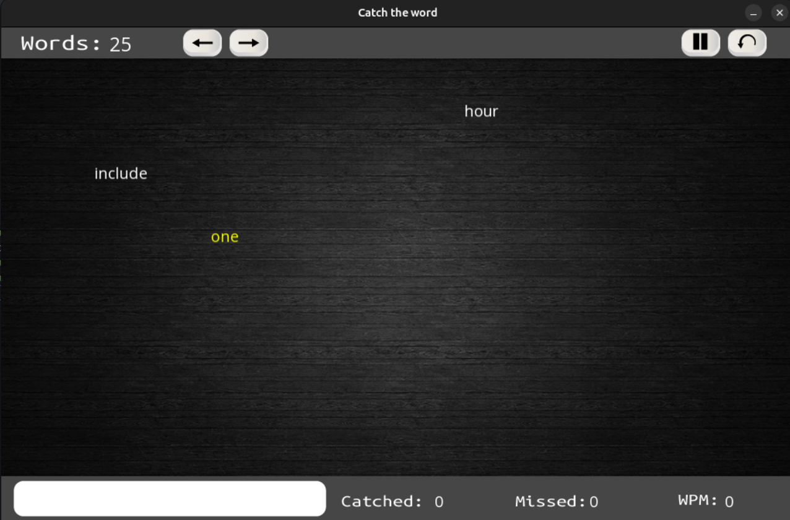
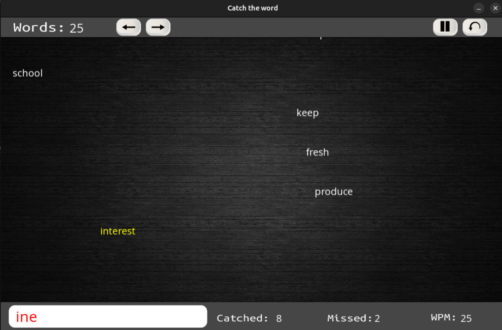

⚠️ Archived – Learning/Experimental Project

Built during an earlier exploration phase.
Left as-is for reference; not actively maintained.

# Catch The Word (CTW)

A simple SFML-based word game built with C++ and CMake.

---

## Screenshots






---

## Platform Note

This project **only reliably works on Linux**.

It may not build or run correctly on Windows due to:
- Platform-specific SFML dependencies
- Different system libraries (X11, udev, etc.)
- Build configuration assumptions

---

## Dependencies

This project uses:

- SFML **2.6.1** (included as a subdirectory)
- CMake **3.26+**
- C++17 compiler (GCC/Clang)

System libraries required on Linux:

```bash
sudo apt install libx11-dev libxrandr-dev libxi-dev libxcursor-dev libxinerama-dev libgl1-mesa-dev libudev-dev
````

---

## Project Structure

```
.
├── SFML/              # SFML 2.6.1 source (included)
├── headers/           # Header files
├── src/               # Game source files
├── main.cpp
├── CMakeLists.txt
└── bin/               # Output binary (created after build)
```

---

## Build Instructions

### 1. Clone the project

```bash
git clone <repo-url>
cd Catch_the_word
```

### 2. Clone SFML v2.6.1

```bash
git clone --branch 2.6.1 --depth 1 https://github.com/SFML/SFML.git
```

---

### 3. Create build directory

```bash
mkdir build
cd build
```

---

### 4. Configure project

```bash
cmake ..
```

---

### 5. Build project

```bash
cmake --build . -j$(nproc)
```

---

### 6. Run game

Binary will be generated in:

```bash
/bin/ctw
```

Run it with:

```bash
cd ..
./bin/ctw
```

---

## Notes

* If you want to extract the final build out of the project, copy both /bin and /assets folders into a separate folder
* SFML is built from source via `add_subdirectory(SFML)`
* No system SFML installation is required
* Build behavior may vary depending on Linux distribution and installed system libraries

---

## Troubleshooting

If build fails:

1. Ensure dependencies are installed (see above)
2. Clean build directory:
3. Check errors for extra missing dependancies

```bash
rm -rf build
mkdir build
cd build
cmake ..
cmake --build .
```
